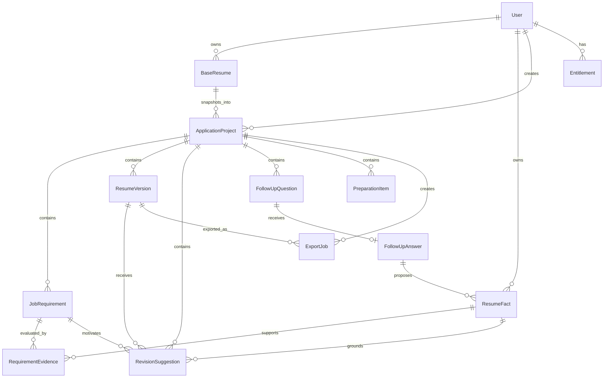
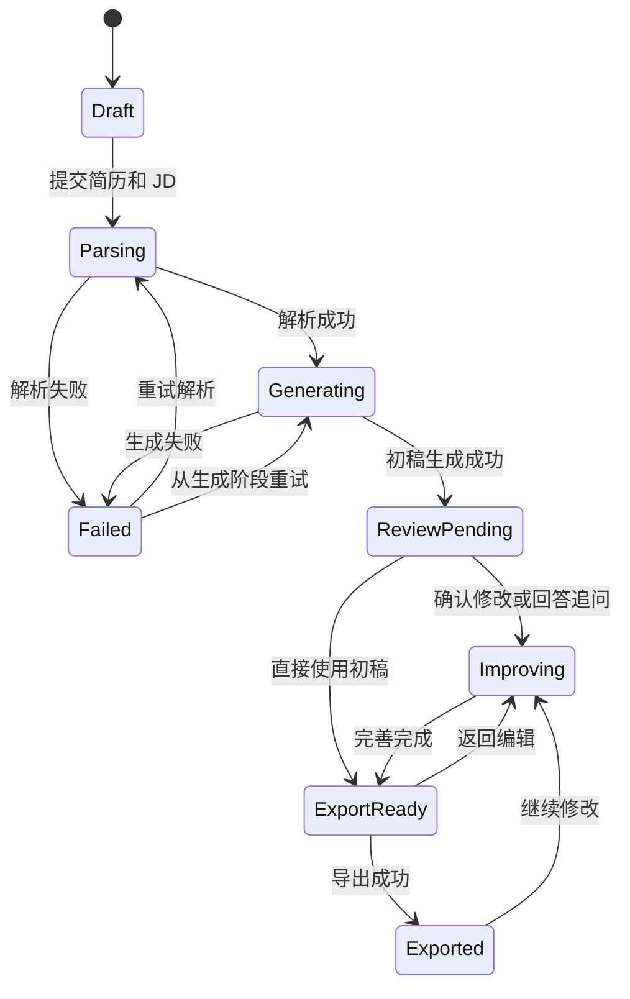
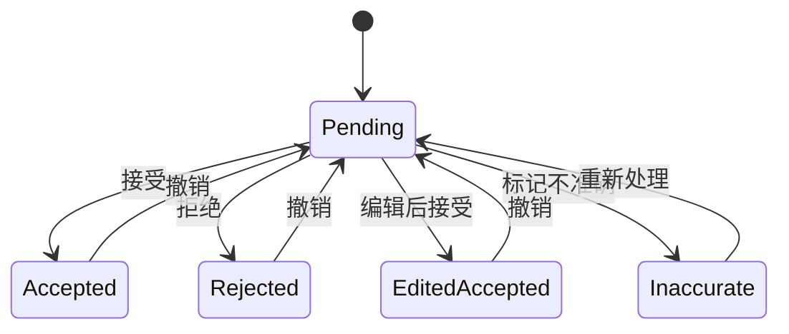

# AI 求职：核心业务对象与模块边界

> 本文定义产品层面的对象、关系和模块职责，不指定数据库、编程语言或技术框架。

## 1. 为什么现在定义这些内容

PRD 描述用户需要什么；业务对象和模块边界负责把需求整理成稳定、可拆分的产品能力。提前定义它们可以避免后续把简历解析、AI 生成、文件导出和付费逻辑混在一起。

## 2. 核心业务对象

### 2.1 用户 User

代表产品账户。

主要信息：

- 用户标识。
- 登录方式与登录凭证标识。
- 账户状态。
- 协议和隐私政策同意记录。
- 创建与更新时间。

用户与其他业务数据之间必须有清晰的所有权关系。

### 2.2 基础简历 BaseResume

用户上传的原始简历及其结构化结果。

主要信息：

- 所属用户。
- 原文件标识、名称、类型和大小。
- 文件解析状态。
- 结构化简历内容。
- 原始段落位置和基础样式信息。
- 是否作为当前默认基础简历。
- 创建与更新时间。

原则：原文件、结构化内容和后续定制版本是不同对象，不能互相覆盖。

### 2.3 简历事实 ResumeFact

能够被简历生成安全使用的一条真实信息。

示例：

- 用户在某项目中使用过摄像头模块。
- 用户负责图像采集链路的调试。
- 用户明确回答没有使用过 V4L2。

主要信息：

- 所属用户。
- 事实内容。
- 事实类型，如技能、职责、工具、结果、时间或否定事实。
- 来源类型：原始简历、用户回答、用户手动编辑。
- 来源位置或来源记录。
- 用户确认状态。
- 是否允许跨项目复用。
- 是否已删除或失效。

只有已确认且未失效的事实可以直接写入正式简历。

### 2.4 投递项目 ApplicationProject

用户针对一个具体 JD 创建的工作空间。

主要信息：

- 所属用户。
- 使用的基础简历及其快照。
- 公司名称和岗位名称。
- 原始 JD。
- 当前项目状态。
- 当前简历版本。
- 付费解锁状态。
- 创建与更新时间。

一个 JD 对应一个投递项目。基础简历被更新时，历史项目不自动变化。

### 2.5 岗位要求 JobRequirement

从 JD 中拆解出的一项明确要求或职责。

主要信息：

- 所属投递项目。
- 要求原文。
- 标准化描述。
- 类型：职责、必备项、加分项、经验、学历等。
- 优先级。
- 是否为明确要求或系统推测。
- 在原 JD 中的位置。

明确要求和系统推测必须区分展示。

### 2.6 要求证据映射 RequirementEvidence

连接岗位要求和简历事实，是产品核心对象之一。

主要信息：

- 对应岗位要求。
- 对应一个或多个简历事实。
- 匹配状态。
- 判断说明。
- 可信程度。
- 是否需要追问。
- 用户反馈。

匹配状态：

- 已有且已体现。
- 已有但未充分体现。
- 尚未证明，需要确认。
- 确实缺失。

### 2.7 简历版本 ResumeVersion

投递项目中的一个完整简历版本。

首版至少保留：

- 原始快照。
- AI 第一版。
- 当前确认版。

主要信息：

- 所属投递项目。
- 版本类型和版本号。
- 结构化内容。
- 排版和样式引用。
- 基于哪个版本生成。
- 创建时间。

用户接受、拒绝或编辑建议时，更新当前确认版，不覆盖原始快照。

### 2.8 修改建议 RevisionSuggestion

AI 针对简历某个位置提出的一项可确认修改。

主要信息：

- 所属投递项目和目标简历版本。
- 原始内容。
- 建议内容。
- 修改类型。
- 修改理由。
- 对应岗位要求。
- 使用的事实来源。
- 用户处理状态。
- 用户编辑后的内容。

处理状态：待处理、已接受、已拒绝、编辑后接受、内容不准确。

### 2.9 追问 FollowUpQuestion

系统为补充高价值事实生成的问题。

主要信息：

- 所属投递项目。
- 关联岗位要求和证据映射。
- 问题内容。
- 为什么提问。
- 优先级。
- 快捷选项。
- 状态：待回答、已回答、跳过、不知道、没做过。

### 2.10 用户回答 FollowUpAnswer

用户对追问的回答。

主要信息：

- 对应追问。
- 回答原文。
- 系统提取的候选事实。
- 用户确认状态。
- 是否允许跨项目复用。

回答本身不能直接写入正式简历，需要先形成修改建议并由用户确认。

### 2.11 岗位准备项 PreparationItem

能力缺口、知识清单或面试准备中的一个条目。

主要信息：

- 所属投递项目。
- 类型：能力缺口、知识主题、面试问题、资料方向。
- 优先级。
- 与 JD 的关系。
- 内容和说明。
- 来源要求。
- 用户状态，如未查看、已查看、已了解。

### 2.12 导出任务 ExportJob

一次 Word 或 PDF 生成任务。

主要信息：

- 所属投递项目和简历版本。
- 导出格式。
- 文件名。
- 任务状态。
- 排版检查结果。
- 输出文件标识与失效时间。
- 失败原因。

### 2.13 权益 Entitlement

用户可使用的付费能力。

主要信息：

- 所属用户。
- 权益类型，如单项目解锁、套餐次数或会员。
- 剩余次数或有效期。
- 关联订单。
- 使用记录。

生成失败不能消耗权益；权益扣除需要可追踪和可恢复。

## 3. 对象关系

## 4. 业务模块边界

### 4.1 账户与权限模块

负责：

- 注册、登录和退出。
- 用户身份和会话。
- 数据所有权检查。
- 协议同意记录。
- 账户和数据删除入口。

不负责简历解析、AI 生成或付费扣次。

### 4.2 文件与文档模块

负责：

- Word/PDF 上传和安全检查。
- 文件元数据和访问控制。
- 文本、段落和基础样式提取。
- 文档预览。
- Word/PDF 生成。
- 分页、溢出和字体问题检查。

它提供统一的文档能力，不负责判断内容是否匹配 JD。

### 4.3 简历域模块

负责：

- 基础简历结构。
- 简历事实。
- 简历版本。
- 简历模块和条目定位。
- 修改应用、撤销和版本快照。

它是所有 AI 输出写入正式简历前的业务闸门。

### 4.4 JD 与岗位分析模块

负责：

- JD 结构化拆解。
- 岗位要求分类和优先级。
- 明确要求与推测内容区分。
- 要求与事实之间的证据映射。
- 匹配状态和解释。

不直接修改简历文档。

### 4.5 AI 编排模块

负责组织以下任务：

- 第一版简历建议生成。
- 修改理由生成。
- 高价值追问生成。
- 回答中的候选事实提取。
- 第二轮建议生成。
- 能力缺口和岗位准备内容生成。

该模块只能通过受控输入读取事实，输出必须经过业务规则校验，不能直接覆盖正式简历。

### 4.6 修改审核模块

负责：

- 展示原文与建议。
- 接受、拒绝、编辑和标记不准确。
- 检查建议使用的事实来源。
- 将已确认建议应用到当前版本。
- 记录撤销和审核状态。

### 4.7 追问与事实确认模块

负责：

- 追问排序和展示。
- 用户回答与跳过状态。
- 从回答生成候选事实。
- 事实确认、复用开关和删除。

### 4.8 岗位准备模块

负责：

- 能力缺口。
- 知识清单。
- 资料方向。
- 面试准备清单。

它消费岗位要求和证据映射，不改变简历事实。

### 4.9 投递项目模块

负责：

- 创建、保存、复制、重命名和删除项目。
- 项目状态流转。
- 聚合工作台所需数据。
- 绑定基础简历快照、JD 和当前版本。

### 4.10 计费与权益模块

负责：

- 免费范围判断。
- 项目解锁、套餐次数和会员权益。
- 订单和支付结果。
- 权益扣除、返还和审计。

它不负责决定 AI 任务是否成功，只依据明确的任务结果扣除权益。

### 4.11 通知与任务状态模块

负责：

- 长任务的阶段状态。
- 完成和失败通知。
- 允许用户离开后返回查看。
- 防止相同任务重复提交。

### 4.12 运营与质量模块

负责：

- 匿名化质量指标。
- 用户对建议“不准确/虚构”的反馈。
- 文件解析和导出异常统计。
- 必要排障的受控访问和审计。

运营人员默认不直接查看用户完整简历。

## 5. 公共组件能力

以下能力会被多个页面和模块复用，应作为公共产品组件设计：

### 5.1 文件上传组件

- 格式、大小和状态展示。
- 失败原因与重试。
- Word 优先提示。
- 敏感信息提醒。

### 5.2 长任务状态组件

- 真实阶段状态。
- 完成、失败和重试。
- 离开页面后的状态恢复。

### 5.3 要求状态标签

统一展示四类匹配状态，包含颜色、图标和文字，不能只依赖颜色。

### 5.4 修改建议卡片

- 原文、建议、理由、JD 对应项和事实来源。
- 接受、拒绝、编辑和不准确反馈。
- 已处理状态和撤销。

### 5.5 事实来源标记

统一表示内容来自：

- 原始简历。
- 用户追问回答。
- 用户手动编辑。

### 5.6 付费解锁组件

- 展示解锁内容。
- 展示套餐或单次购买入口。
- 关闭后不重复遮挡用户。

### 5.7 删除确认组件

用于删除项目、简历、事实和账户。必须说明删除范围和后果，避免误删。

### 5.8 导出检查组件

- 分页预览。
- 溢出、跨页和字体异常。
- Word/PDF 格式选择。
- 文件名编辑。

## 6. 关键业务状态机

### 6.1 投递项目状态

### 6.2 修改建议状态

## 7. 不可跨越的模块规则

- AI 编排模块不能直接覆盖正式简历版本。
- 文件模块不能根据内容自行判断用户拥有某项能力。
- 岗位分析模块不能把推测要求伪装为 JD 原文。
- 用户未确认的回答不能进入可复用事实库。
- 删除或失效的事实不能用于新项目。
- 生成失败不能扣除付费次数。
- 运营后台默认不能绕过用户权限读取完整简历。
- 历史投递项目使用基础简历快照，不能随基础简历更新而静默改变。

## 8. 后续 Spec 拆分建议

PRD 和技术方案确认后，可以按以下顺序拆成小 Spec：

1. 账户、项目和权限基础能力。
2. Word/PDF 上传与文本提取。
3. 简历结构化和基础简历展示。
4. JD 输入、拆解和岗位要求展示。
5. 要求—事实证据映射。
6. 第一版修改建议生成。
7. 简历预览和修改确认。
8. AI 追问、回答和事实确认。
9. 岗位准备内容。
10. Word/PDF 导出与预览检查。
11. 付费与权益。
12. 数据删除、监控和质量反馈。

每个 Spec 应只包含一个可独立演示和验收的闭环。

