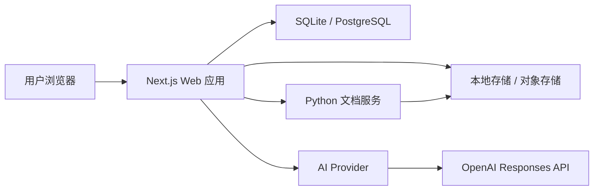
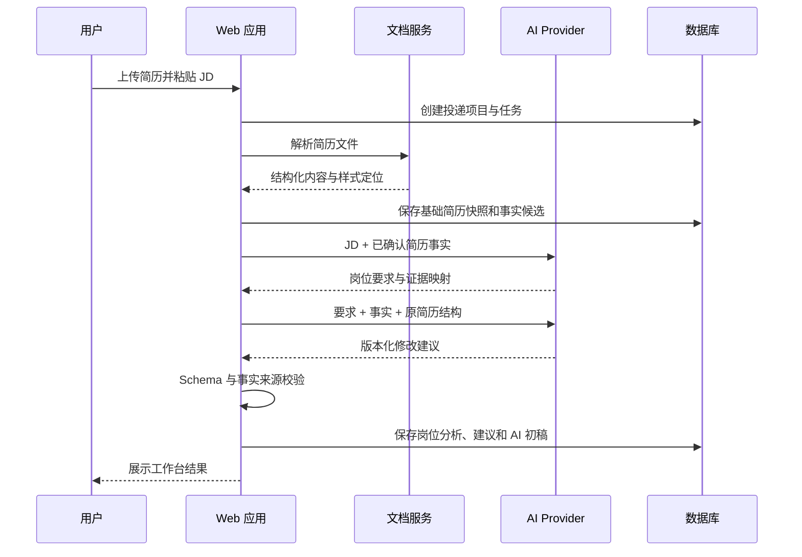
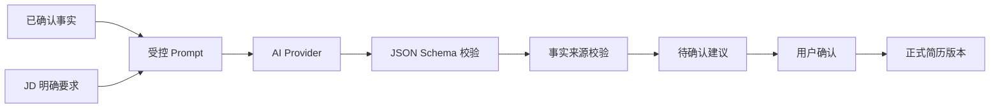

# AI 求职：系统架构 v0.1

## 1. 架构目标

架构既要让单用户 Alpha 尽快运行，也要让未来多用户 SaaS 可以逐步替换数据库、存储、认证和任务执行方式，而不重写核心业务。

## 2. 系统上下文



## 3. 代码仓库结构

```text
ai求职/
├─ apps/
│  └─ web/                    # Next.js 网页和服务端业务入口
├─ services/
│  └─ document-worker/        # Word/PDF 解析、修改、预览和导出
├─ packages/
│  ├─ contracts/              # 跨服务 JSON Schema 与 TypeScript 类型
│  ├─ domain/                 # 纯业务规则，不依赖页面或供应商
│  └─ config/                 # 共享代码质量配置
├─ storage/                   # Alpha 本地文件，禁止提交
├─ product/                   # 产品需求文档
├─ technical/                 # 技术方案与开发 Spec
├─ rules/                     # 开发过程中沉淀的可复用规则
├─ tests/
│  └─ fixtures/               # 脱敏文档回归样本
├─ .env.example
├─ package.json
├─ pnpm-workspace.yaml
└─ README.md
```

## 4. Web 应用分层

```text
页面与组件
    ↓
用例服务（创建项目、生成初稿、确认修改、导出）
    ↓
领域规则（事实、证据、建议、版本、状态机）
    ↓
端口接口（AI、文档、存储、认证、任务）
    ↓
具体适配器（OpenAI、FastAPI、本地文件、SQLite）
```

关键约束：

- 页面不能直接调用 OpenAI。
- AI 返回不能直接写入正式简历。
- 所有建议先进入待确认状态。
- 文件路径不能直接作为公开 URL。
- 领域规则不依赖 Next.js、Prisma 或具体 AI SDK。

## 5. 核心接口

### 5.1 `AiProvider`

负责：

- 拆解 JD。
- 建立要求与事实证据映射。
- 生成第一版修改建议。
- 生成追问。
- 从回答中提取候选事实。
- 生成岗位准备内容。

输入输出必须使用版本化契约，例如：

- `job-analysis.v1`
- `evidence-map.v1`
- `revision-suggestions.v1`
- `follow-up-questions.v1`

### 5.2 `DocumentService`

负责：

- 解析 DOCX/PDF。
- 返回结构化段落和样式定位信息。
- 将已确认修改应用到文档副本。
- 生成 DOCX。
- 渲染预览或 PDF。
- 返回排版警告。

### 5.3 `FileStorage`

负责：

- 保存源文件和导出文件。
- 生成受控读取流或短期下载地址。
- 删除项目相关文件。
- 隔离不同用户的存储命名空间。

### 5.4 `TaskRunner`

负责：

- 提交长任务。
- 查询阶段状态。
- 幂等执行。
- 失败重试。
- 完成后保存结果。

### 5.5 `AuthProvider`

Alpha 返回固定本地用户；SaaS 替换为真实身份服务。业务层只接收可信 `userId`。

## 6. 第一版生成数据流



## 7. 修改确认数据流

1. 用户选择接受、拒绝或编辑建议。
2. Web 用例服务校验项目所有权和建议当前状态。
3. 接受前再次确认建议引用的事实仍然有效。
4. 领域服务将修改应用到结构化简历的当前确认版。
5. 保存审核记录和新版本号。
6. 前端刷新对应局部预览。

AI 不参与“是否允许写入正式版本”的最终判断。

## 8. 文档处理策略

### 8.1 DOCX 输入

采用“局部补丁”策略：

1. 保留原始 DOCX 作为不可变源文件。
2. 解析段落、表格、文本 Run、样式、页眉页脚和节信息。
3. 为可修改文本建立稳定定位标识。
4. 只替换用户确认的文本范围，尽量复用原 Run 样式。
5. 输出到新的 DOCX，不覆盖源文件。
6. 对字数显著增加、段落跨页等情况产生警告。

### 8.2 PDF 输入

PDF 不作为可直接修改的源文档：

1. 提取文本块、坐标、字体和页面信息。
2. 重建内部简历结构。
3. 输出一份相似布局的可编辑 DOCX。
4. 明确标记为“重建版式”。

### 8.3 PDF 输出

Alpha 在未安装 LibreOffice 前：

- 优先完成 DOCX 输出。
- PDF 输出接口先保留为能力状态，不伪造已支持。

安装 LibreOffice 后通过无界面模式将 DOCX 转换为 PDF，并在相同环境中进行预览回归。

## 9. AI 安全链路



任何一步失败都不能静默降级为自由文本写入。

## 10. 数据隔离

- 所有用户业务对象包含 `userId`。
- 所有项目级查询同时使用 `userId` 和 `projectId`。
- 本地存储目录按用户和项目分层。
- 导出文件通过受控接口下载。
- 日志使用对象 ID，不记录完整正文。
- 删除项目时同时删除相关源文件、导出文件和任务结果。

## 11. 任务与幂等

每个长任务包含：

- 任务类型。
- 项目 ID。
- 输入版本。
- 幂等键。
- 当前阶段。
- 尝试次数。
- 结果引用或失败原因。

同一个项目、任务类型和输入版本只允许有一个有效任务。重试复用原任务记录，不重复扣权益。

## 12. Alpha 运行方式

本机启动两个进程：

1. Next.js Web 应用。
2. Python 文档服务。

SQLite 和本地文件存储不需要独立进程。AI Key 缺失时使用 Fake Provider 运行界面和业务流程。

## 13. 未来升级路径

### 自用 Alpha → 邀请制内测

- 增加真实邮箱登录。
- SQLite 迁移 PostgreSQL。
- 本地存储迁移对象存储。
- 增加后台任务 Worker。
- 安装稳定 DOCX 转 PDF 环境。

### 邀请制内测 → 公开 SaaS

- 增加手机号登录和支付。
- 增加权益、退款和风控。
- 完成隐私合规审查。
- 增加监控、审计、备份和灾难恢复。
- 根据真实成本进行模型分层和缓存优化。

## 14. 架构验收标准

- Web 和文档服务可以独立启动和测试。
- 无 API Key 时 Fake Provider 可跑通核心页面。
- 领域规则不直接依赖 OpenAI SDK。
- AI 输出经过 Schema 和事实来源双重校验。
- 原始简历不可被覆盖。
- 项目和文件均按用户隔离。
- 文档处理和 AI 处理失败可以独立重试。
- SQLite、文件存储和认证实现可通过适配器替换。

